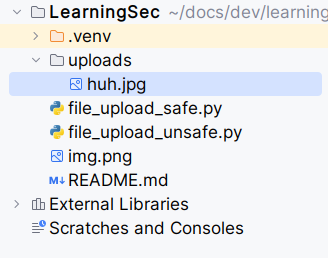
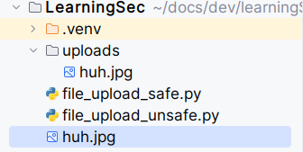

# 🖋️ Learning Secure Development (but it is only about sanitizing user input)

* Lack of the validation of user input brings next vulnerabilities:
    * SQL Injection
    * XSS
    * LFI/Path Traversal
    * Server Side Template Injection
    * Command Injection

## Securing work with SQL

### What can go wrong?

With SQL injection vulnerability an attacker can:

1. Retrieving data from other database tables

    Getting data from another table `users`.

    Vulnerable code:

    ```python
    brand = uri_args.get("brand")
    query = "SELECT name, price FROM products where brand == '%s';" % brand
    sql_obj.execute(query)
    ```
   
    The variable `brand` is user-controlled and could be somethong like: `' UNION SELECT username, password from users;--`.
    Then the execution query will be:

    `SELECT name, price FROM products where brand == '' UNION SELECT username, password from users;--';`


2. Subverting application logic

    Bypassing vulnerable authentication.

    ```python
    username = uri_args.get("username")
    password = uri_args.get("password")
    
    # checking creds
    query = "SELECT username, password FROM usernames where username == '%s' and password == '%s'" % (username, password)
    if result := sql_obj.execute(query):
        # the object exists so the user submitted right creds
        authenticate()
    else:
        # nothing returned, so the creds are wrong
        send_error()
    ```

    Variables `username`, `password` are user controlled. So...

    Logging in knowing username without password:
    * `username`: `admin--` -- just comment the password part
    * `username`: `admin' AND 1=1--` -- Tru and True makes true
   
    Logging in without knowing username:
    * `username`: `ololo' OR 1=1--` -- False or True makes True


3. Real nasty shit

    File upload -> RCE:

        ' UNION SELECT '<?php system($_GET['cmd']); ?>' INTO OUTFILE '/var/www/html/shell.php' #

    File read:

        ' UNION SELECT load_file('/etc/passwd') #

### How to secure?

1. Use well-known libraries for querying SQL database (and NotSQL too!)

    ```python
    from flask_sqlalchemy import SQLAlchemy
    from flask_bcrypt import Bcrypt
   
    db = SQLAlchemy()
    ...
    bcrypt = Bcrypt(app)

    class User(db.Model):
        __tablename__ = 'users'
    
        id = db.Column(db.Integer, primary_key = True)
        username = db.Column(db.String)
        _password_hash = db.Column(db.String)
   
        def authenticate(self, password):
            return bcrypt.check_password_hash(self._password_hash, password.encode('utf-8'))
   
    ...
   
    username = request.get('username')
    password = request.get('password')

    user = User.query.filter(User.username == username).first()
    if user:
        if user.authenticate(password):
            # OK, creating session for a new user
        else:
            # wrong creds
    ```

2. Check OWASP guidelines: [SQL Injection Prevention Cheat Sheet](https://cheatsheetseries.owasp.org/cheatsheets/SQL_Injection_Prevention_Cheat_Sheet.html)

## Securing file upload/download functionality

### What can go wrong?

Lack of sanitizing of user input can cause the following situations:

1. Hacker might be able to read files from you system (dangerous!). It will help them to gather data and prepare an attack.
2. Hacker can write files on your system causing various problems (very dangerous!). It probably will end up with code execution.

### How it looks like 

#### File download with insecure file names

There is a vulnerable download function (check [file_upload_unsafe.py] for full code):

```python
@app.route('/uploads')
def download_file():
    filename = request.args.get('file', '')
    path_to_file = os.path.join(app.config["UPLOAD_FOLDER"], filename)
    return send_file(path_to_file)
```
It takes a file name from the request without validation and concatenates it with path to the uploads' directory.


#### File upload with insecure file names

There is a vulnerable upload function (check [file_upload_unsafe.py] for full code):

```python
@app.route('/', methods=['GET', 'POST'])
def upload_file():
    if request.method == 'POST':
        ...
        file.save(os.path.join(os.path.join('uploads', file.filename)))
        return redirect(url_for('download_file', name=file.filename))
   ```
   
It takes a file name from the request without validation and concatenates it with path to the uploads' directory.

Let's upload a file with a POST request:

```bash
$ curl http://127.0.0.1:5000/ -F "file=@/home/l1sp3r/pics/huh.jpg"
```

In this request the filename is "huh.jpg". The path to save will be: `"uploads/huh.jpg"`

As a result we can find our file in `uploads/` directory:



Let's do a malicious request changing the filename:

```bash
$ curl http://127.0.0.1:5000/ -F "file=@/home/l1sp3r/pics/huh.jpg;filename=../huh.jpg"
```

In this request the filename is "../huh.jpg". The result of `os.path.join("uploads", "../huh.jpg")` will be `"huh.jpg"` because of how Linux works with file paths. The file will be saved in the root directory of your application.



Possible implications:

1. Hacker can upload config files (web.config in IIS, .httpaccess in Apache, etc.) and change the behaviour of your application or get straightforward RCE.
2. (in case of Python) hacker can guess the name of a main script ('main.py') and upload a script with the same name the causing webserver to reload it and execute this code.

TODO: example

### How to secure?

1. Sanitize file name using well-known libraries

    ```python
    from werkzeug.utils import secure_filename
    ...
    file = request.files['file']
    filename = secure_filename(file.filename)
    ```

2. Use functions from your framework to work with files

    ```python
    from flask import send_from_directory
   
    @app.route('/uploads/<name>')
    def download_file(name):
        return send_from_directory(app.config["UPLOAD_FOLDER"], name)
    ```

3. It is a good thing to reduce file formats the user can upload. But, as always, use well-known libraries for this.
4. Read the documentation of your framework! It often has security notes. For example, I took this examples from [Uploading Files](https://flask.palletsprojects.com/en/2.3.x/patterns/fileuploads/) article from Flask documentation.


## Securing templating

### What can go wrong?

Web application use templating to render web pages with dynamic data. The can execute code, so if there is a Server Side Template Injection, an attacker can run code on your machine, which is very, very bad.

### How it looks like

Right way to use templates:

```python
from flask import render_template_string

@app.route("/")
def home():
    if user := request.args.get('user'):
        return render_template_string('Hello, {{ username }}!', username=user)
```

The expression in '{{ }}' will be interpreted by Jinja2 and the variable "username" will be substituted by the parameter user given from a user.
The template engine also handle default expressions (if-else), run functions, etc.

The template engine will sanitize the parameters ("username" in the example) by itself. So all you need is to use it.

Wrong way to use templates:

```python
from flask import render_template_string

@app.route("/")
def home():
    if user := request.args.get('user'):
        return render_template_string('Hello, %s!' % user)
```

Although there are no validation of 'user' parameter, the attacker can inject Jinja2 expression into it: `user=alex"}}{{ os.__dict__ }}`

```bash
$ curl 'http://127.0.0.1:5000?user=alex"%7D%7D%7B%7Bself.__dict__%7D%7D' --path-as-is
```

And get the `os.__dict__` executed and printed to them.

### How to secure?

1. Just use the templating library functions:

    ```python
    render_template_string('Hello, {{ username }}!', username=user)
    ```

## Securing command injections

...

## XSS

...

## Interesting cases

- Host header
- User-Agent
- Cookie
